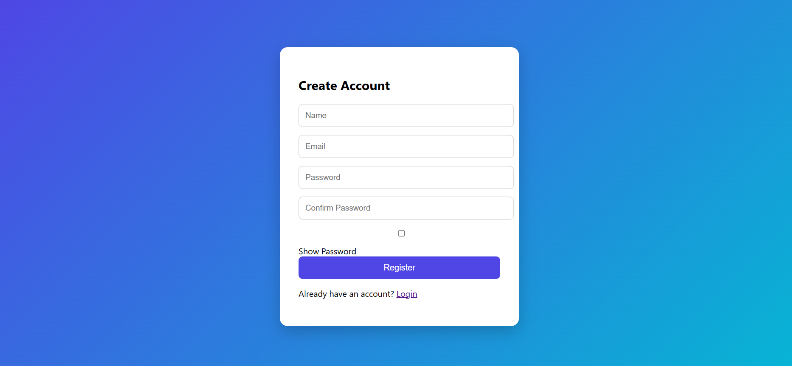
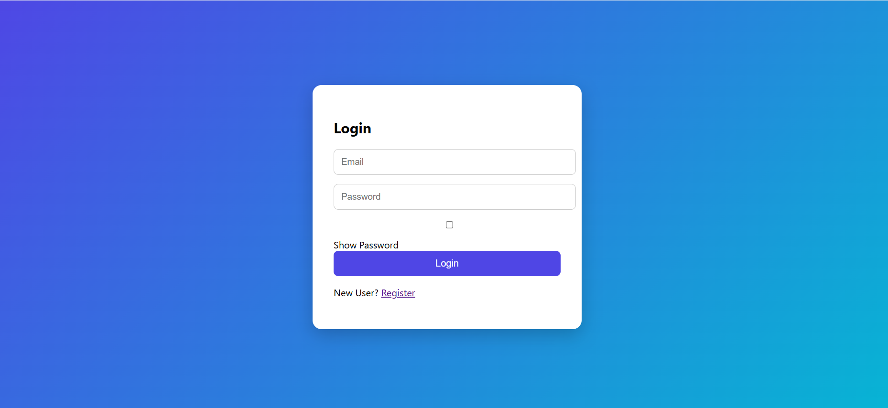

# 🔐 Secure Authentication System

A secure authentication system developed using **Node.js, Express.js, MongoDB, JWT, and Bcrypt.js**. This application enables users to register, log in securely, access a protected dashboard, and log out using JSON Web Token (JWT) based authentication.

---

## 🚀 Features

- User Registration
- User Login
- Secure Password Hashing using Bcrypt
- JWT Authentication
- Protected Dashboard
- User Logout
- Email Validation
- Password Strength Validation
- Confirm Password Validation
- Show / Hide Password
- Responsive User Interface

---

## 🛠️ Technologies Used

### Frontend
- HTML5
- CSS3
- JavaScript

### Backend
- Node.js
- Express.js

### Database
- MongoDB
- Mongoose

### Authentication
- JSON Web Token (JWT)
- Bcrypt.js

---

## 📂 Project Structure

```
PRODIGY_WD_01
│
├── backend
│   ├── config
│   ├── controllers
│   ├── middleware
│   ├── models
│   ├── routes
│   ├── package.json
│   └── server.js
│
├── frontend
│   ├── css
│   ├── js
│   ├── login.html
│   ├── register.html
│   └── dashboard.html
│
├── screenshots
│   ├── register.png
│   ├── login.png
│   └── dashboard.png
│
└── README.md
```

---

## ⚙️ Installation

### Clone the Repository

```bash
git clone https://github.com/Sujal-dev5/PRODIGY_WD_01.git
```

### Navigate to Backend

```bash
cd PRODIGY_WD_01/backend
```

### Install Dependencies

```bash
npm install
```

### Create Environment Variables

Create a `.env` file inside the `backend` folder.

```env
PORT=5000
MONGO_URI=your_mongodb_connection_string
JWT_SECRET=your_secret_key
```

### Run the Server

```bash
npm run dev
```

### Open Frontend

Open `register.html` using **Live Server** in Visual Studio Code.

---

# 📸 Screenshots

## Registration Page



---

## Login Page



---

## Dashboard


---

## 🔮 Future Improvements

- Forgot Password
- Email Verification
- Profile Update
- Change Password
- Refresh Token Authentication
- Dark Mode

---

## 👨‍💻 Author

**Sujal Patil**

GitHub: https://github.com/Sujal-dev5

---

## 📄 License

This project is developed for educational purposes as part of the **Prodigy InfoTech Web Development Internship**.